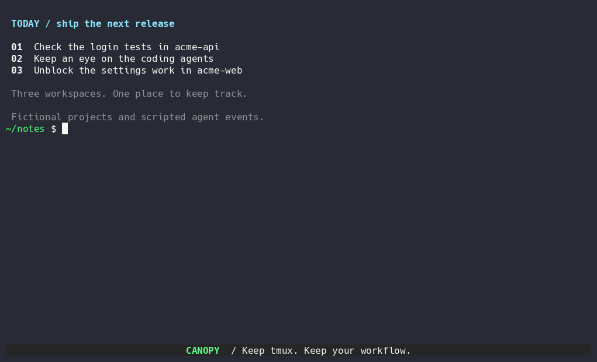

# tmux-canopy

[](https://github.com/jonmosco/tmux-canopy/actions/workflows/test.yml)

**A tmux workspace tree and AI-agent monitor in one sidebar, with no daemon.**

Canopy keeps your sessions, windows, and panes in a persistent tree that follows you as you switch windows and sessions, with the same selection and the same folded branches. Turn on agent mode and the same tree shows what every Claude Code, Codex, OpenCode, Gemini, Cursor, Antigravity, and Pi session is doing: which agents are working, which subagents they started, and which are waiting for you. Press `n` to jump straight to the next one that needs input.

## Preview

[](docs/assets/canopy-demo.gif)

[View a still image](docs/assets/canopy-demo.png).

## Quick start

1. Install [tmux](https://github.com/tmux/tmux), [fzf](https://github.com/junegunn/fzf), and Bash 4.4+ (see [Requirements](#requirements-and-support)). With [TPM](https://github.com/tmux-plugins/tpm), add this before its `run '~/.tmux/plugins/tpm/tpm'` line:

   ```tmux
   set -g @plugin 'jonmosco/tmux-canopy'
   set -g @tmux-canopy-agents 'on'   # optional: monitor AI coding agents
   ```

2. Press **prefix + I** to install.
3. Press **prefix + T** to open the sidebar (with the default prefix: **Ctrl-b**, then **Shift-t**). Press `?` inside it for every key.

For agent status beyond process detection, run `~/.tmux/plugins/tmux-canopy/canopy setup` and pick your agents (see [AI agent monitoring](#ai-agent-monitoring)). [Manual installation](#install) needs no plugin manager.

## Features

- Sessions → windows → panes tree with application icons and an active-location marker.
- Left or right placement; **left by default**.
- Width-aware directory grouping, optional minimal and compact views, previews, and scrollable popup help.
- Global quick switching, including panes inside collapsed branches.
- Tree filters for the current session, unread notifications, window names, and pane titles.
- Create, rename, move, link, and delete tmux objects with native menus and direct keys.
- Zoom badges (`[Z]`), native pane/window zoom toggle, and automatic sidebar width balance when closing panes.
- Process trees attributed to panes, plus tmux buffer browsing with a system-clipboard yank action.
- AI agent monitoring: Track active agents across sessions with animated status badges, a dedicated Agents view (`4`), summary drawer (`i`), subagent trees, and a one-key jump (`n`) to panes waiting for user input or approval.
- Activity and bell notifications; optional silence monitoring.
- Live mouse resizing and keyboard width presets.
- One sidebar owned by the client that opened it; no daemon or agent service.

## Requirements and support

Tested on **Linux** and **macOS**, with:

- tmux **3.7c**
- fzf **0.74.4**
- Bash **4.4+** (locally tested with 5.3.9)
- Standard command-line utilities, including awk and `ps` (procps or macOS BSD `ps`)
- `less` for the optional enlarged preview

Startup checks tmux capabilities and fzf options before splitting an application pane. Older tmux/fzf versions are not currently part of the tested support matrix. The default Unicode icons are command-specific and do not require a Nerd Font. Set the `nerdfont` icon theme for additional app glyphs after enabling a Nerd Font in your terminal; use `ascii` if Unicode glyphs are missing.

## Install

Install the requirements first. If you use [TPM](https://github.com/tmux-plugins/tpm), add this before its `run '~/.tmux/plugins/tpm/tpm'` line:

```tmux
set -g @plugin 'jonmosco/tmux-canopy'
```

Press **prefix + I** to install, then **prefix + T** to open Canopy.

For a manual installation, clone the project:

```bash
git clone https://github.com/jonmosco/tmux-canopy.git ~/.tmux/plugins/tmux-canopy
```

Add this to your tmux configuration (usually `~/.tmux.conf` or `~/.config/tmux/tmux.conf`):

```tmux
run-shell '~/.tmux/plugins/tmux-canopy/tmux-canopy.tmux'
```

Load it into a running tmux server:

```bash
tmux run-shell "$HOME/.tmux/plugins/tmux-canopy/tmux-canopy.tmux"
```

Press **prefix + T** to open it. With the default prefix, press **Ctrl-b**, release, then **Shift-t**. The same shortcut closes it.

Run `~/.tmux/plugins/tmux-canopy/canopy doctor` to check requirements and see every active tmux binding, option, and hook Canopy installs. Add the repository root to your `PATH` if you prefer the short `canopy` command.

### AI agent monitoring

With agent mode on, Canopy finds agents running in any pane of any session and shows their state in the tree:

- **Agents view (`4`):** only the sessions, windows, and panes that contain an agent, with a summary such as `◆1 ▷2` in the header.
- **Status on every agent pane:** working (an animated `▷`) and needs input (`!`). Folded windows and sessions roll these up as `◆` and `▷` counts.
- **Subagents:** listed under their parent pane while they run, each with its own status.
- **Jump to blockers (`n`):** the next pane waiting for an approval, question, or input, across all sessions.
- **Summary drawer (`i`):** the selected agent's state, its age, and the pending request when the agent reports one.

Turn it on with `set -g @tmux-canopy-agents 'on'` **before** the Canopy line in your tmux configuration, then reload and reopen the sidebar. Press `A` in the sidebar to switch it on or off for just your client.

| Agent | Found by process | Lifecycle adapter | Needs input | Subagents |
|---|---|---|---|---|
| Claude Code | ✅ | ✅ hooks | ✅ | ✅ |
| Codex | ✅ | ✅ hooks | ✅ | ✅ |
| OpenCode | ✅ | ✅ plugin | ✅ permissions and questions | ✅ |
| Gemini CLI | ✅ | ✅ hooks | ✅ tool permissions | – |
| Cursor Agent (`agent`) | ✅ | ✅ hooks, partial | – no permission event | ✅ |
| Antigravity (`agy`) | ✅ | ✅ hooks | – no permission event | – |
| Pi and Oh My Pi | ✅ | ✅ extension | ✅ extension prompts | – |

Process detection needs no setup: a running agent shows as `[process]` in the Agents view. An adapter adds its exact state (working, needs input, turn ended, and so on). Adapters are optional and observational: they never approve a request or block a tool. Install only the ones you want with `canopy setup`, or `canopy integration install <agent>` using `claude`, `codex`, `opencode`, `gemini`, `cursor-agent`, `agy`, `pi`, or `omp`, then restart that agent inside tmux. `canopy integration status` lists what is installed. Adapters need Python 3. Agent-specific notes, including OpenCode's plugin and Antigravity's hook file, are in [Agent lifecycle adapters](docs/reference.md#agent-lifecycle-adapters).

### Defaults

Canopy opens on the **left**, follows its client across windows and sessions, and uses stable slots to keep application geometry steady when revisiting windows. It starts at 42 columns. Mouse resizing is live, with no fixed maximum; at least 40 columns are reserved for content.

Place settings **before** the `run-shell` line:

```tmux
set -g @tmux-canopy-position 'left'       # left or right
set -g @tmux-canopy-width '42'
set -g @tmux-canopy-scope 'global'        # global or window
set -g @tmux-canopy-transition 'slot'     # slot or move
set -g @tmux-canopy-resize-mode 'live'    # live, staged, or preset
set -g @tmux-canopy-max-width '0'         # 0 means no fixed cap
set -g @tmux-canopy-min-content-width '40'
set -g @tmux-canopy-density 'normal'    # normal, minimal, compact, or detailed
set -g @tmux-canopy-appearance 'default'  # default (folders + icons) or ascii
set -g @tmux-canopy-animate 'on'          # off: disable the WORKING status animation
set -g @tmux-canopy-zoom-action 'refuse'   # refuse (default) or unzoom
```

Reload your tmux configuration after changing settings. Close and reopen Canopy after changing position or startup appearance options.

## Essential controls

| Key | Action |
|---|---|
| `j` / `k`, arrows | Select an object |
| `Enter` | Focus the selected target |
| `h` / `l` | Collapse / expand |
| `H` / `L` | Collapse / expand all |
| `/`, then `Esc` | Search, then clear the search query |
| `1` / `2` / `3` | Tree / Processes / Buffers |
| `a` | Actions for the selected object |
| `z` | Toggle zoom on the selected pane or window |
| `b` | Break selected pane into its own window |
| `s` / `v` | Create horizontal / vertical split from selected node |
| `t` | Create new window in selected session |
| `S` / `N` | Create session / create named session with prompt |
| `r` | Rename selected session or window |
| `x`, then `x` | Confirm deletion of a pane, window, session, or paste buffer |
| `m` / `c` | Mark move source / cancel move mode |
| `u` / `U` | Clear selected / all notifications |
| `F` / `Ctrl-f` | Tree filters: All / Current session / Unread, plus window name and pane title |
| `Ctrl-g` | Search all sessions, windows and panes, including collapsed branches |
| `Ctrl-o` | Return the selection pointer to the current pane or its visible parent |
| `p` / `P` | Toggle preview / open enlarged terminal preview |
| `[` / `]` | Previous / next width preset |
| `Ctrl-r` | Refresh |
| `?` | Scrollable help popup |
| `g` | Scrollable symbol and color legend |
| `Ctrl-q` | Close the sidebar |

Use your usual tmux pane navigation to return to the sidebar after focusing an application, such as `prefix + Left` or `prefix + Right`.
When you leave the sidebar for a content pane, its selection pointer follows the active pane automatically.

With agent monitoring enabled, `4` opens Agents, `n` jumps to the next pane reporting needs-input, and `i` switches the drawer to an agent summary.

### Understanding the sidebar header

The top bar displays the available views and the active tree filter:

```text
╭─ Tree Agents Proc Buff ─ All
```

- **Views (`1`–`4`):** The highlighted name indicates the active view. Switch views with `1` (**Tree**), `4` (**Agents**), `2` (**Proc**), and `3` (**Buff**).
- **Scope filter (`─ All`):** Indicates the visibility filter currently applied to the tree. Press **`F`** or **`Ctrl-f`** to cycle or configure:
  - **`All`** — Display all sessions and panes across the entire tmux server.
  - **`Session`** — Filter the tree to display only the current session.
  - **`Unread`** — Display only windows and panes with unread activity, bell, or silence alerts.
  - **`+W` / `+T`** — Appended when an active window name (`+W`) or pane title (`+T`) search rule is applied (e.g., `All+W`).

The default Tree view uses one active-pane dot, shorter branch prefixes, and
directory labels that adapt to sidebar width. For the leanest view, set
`@tmux-canopy-density 'minimal'` and press `Ctrl-r` in the sidebar.
The default appearance groups panes by working directory and uses folder and
application icons. Set `@tmux-canopy-appearance 'ascii'` for an ASCII-only view
without glyph-font requirements. Recognized app icons can be changed with
options such as `@tmux-canopy-icon-codex`; use `none` to hide one. See
[Icons](docs/reference.md#icons).

See the [configuration and command reference](docs/reference.md) for all controls, appearance settings, notifications, and architecture.

## How it works

- **No daemon.** Canopy is Bash, awk, and fzf, driven by tmux hooks. Between events, only bounded helpers run: the animation while an agent is visibly working, and a sleeping timer per agent report that marks it stale.
- **One snapshot per refresh.** A single tmux call collects every session, window, pane, and client. awk renders the tree, and fzf reloads in place, keeping your selection, search, and folded branches. A refresh typically takes tens of milliseconds.
- **Event-driven updates.** Focus changes, splits, renames, activity alerts, and agent reports trigger a short debounced reload. Hooks for ordinary panes are filtered inside tmux, so they start no shell at all.
- **Verified agent state.** A hook report counts only while its process ID and start time still match a live process in that pane, so a restarted or replaced agent never inherits old status. A report with no update for 15 minutes is shown as stale.
- **Owned by one client.** Each sidebar belongs to the client that opened it and follows that client across windows and sessions.

See [Architecture](docs/reference.md#architecture) for the details.

## Integration with your tmux configuration

Canopy wraps `prefix + n`, `p`, `0`–`9`, and `Tab` for smooth window navigation, `prefix + Space` for sidebar-aware layouts, and border mouse bindings for resizing. Set `@tmux-canopy-smooth-navigation 'off'` to opt out of navigation wrappers. Disabled or renamed bindings restore their previous definitions; later user changes are preserved. Notification monitors are also restored when disabled.

## Current limitations

- Stable slots are optimized for one active sidebar owner per tmux server. Multiple simultaneous owners can affect each other’s window geometry.
- A directory-only change may need `Ctrl-r`; there is no shell prompt integration or polling loop.
- Activity means terminal output, not an AI agent’s task status. Without an [optional lifecycle adapter](docs/reference.md#agent-lifecycle-adapters), the agent drawer reads the selected pane’s current terminal screen and labels possible requests as unverified. Continuous logs can be noisy.
- Closing the sidebar returns its space but may not restore every previous pane proportion.
- Confirmed deletion has no undo.

Moving an open sidebar between edges and other planned work are described in the [roadmap](ROADMAP.md).

## Development and release checks

Tests additionally require Python 3, ShellCheck, and procps utilities. Optional zsh/fish launch checks run when those shells are installed.

```bash
bash tests/run.sh
```

The same gate runs in GitHub Actions using pinned tmux/fzf versions. Tests use private tmux servers and do not modify your active sessions. See the [release checklist](docs/releasing.md) and [changelog](CHANGELOG.md).

## Contributing

Canopy is in active development. Bug reports, feature requests, and pull requests
are welcome - open an issue at
[github.com/jonmosco/tmux-canopy/issues](https://github.com/jonmosco/tmux-canopy/issues).

## License

[Apache License, Version 2.0](LICENSE).
